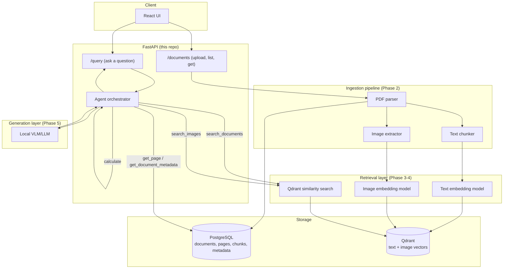

# Architecture & Scope

Current status: **Phase 8 complete** (React frontend, streaming, history,
local-only Docker Compose). Phase 1 defined the scope, data model, and
interfaces below; Phase 2 implemented the PDF → structured document pipeline;
Phase 3 added embeddings, the Qdrant index, and a `/search` endpoint; Phase 4
added image embeddings and fused text and diagram evidence into one ranking;
Phase 5 answers questions from that evidence with a local model, citing pages
and refusing when the evidence does not support an answer; Phase 6 adds an
agent that decides for itself which of five tools — text search, image
search, an exact page lookup, a calculator, and document metadata — a
question needs, rather than always running the same fixed retrieve-then-answer
pipeline; Phase 7 measures all of the above against a real question set and a
real corpus, reporting Recall@K/Precision@K/MRR, faithfulness, hallucination
rate, and latency as numbers rather than impressions; Phase 8 puts a React UI
in front of all of it, with token-by-token streaming, browsable Q&A history,
and one command (`docker compose up --build`) that runs the entire system —
frontend included — locally, with nothing deployed anywhere.


## Domain

**Industrial equipment technical manuals.** A user uploads a PDF manual (text,
tables, diagrams, photos) and asks natural-language questions about the
equipment it describes. The system answers using evidence retrieved from the
manual and cites the source page(s). When the manual doesn't contain enough
evidence, it says so instead of guessing.

## Supported inputs

- PDF documents containing:
  - body text
  - tables
  - diagrams / schematics / photos (raster images embedded in the PDF)
- One manual at a time is treated as a `Document`; a manual can span many
  `Page`s, and each page can yield multiple text `Chunk`s and zero or more
  extracted `Image`s.

## User flow (target, end of Phase 5)

```
Upload PDF
   │
   ▼
Parse (text + tables + images, per page)
   │
   ▼
Chunk text  ──────────────┐
   │                      │
   ▼                      ▼
Embed text            Extract & embed images
   │                      │
   ▼                      ▼
        Qdrant (vectors) + Postgres (metadata)
                   │
                   ▼
        User asks a question
                   │
                   ▼
        Retrieve top-k text chunks + images
                   │
                   ▼
        Local VLM/LLM answers using ONLY retrieved evidence
                   │
                   ▼
        Answer + page citations, or "I don't know"
```

## System architecture (target, end of Phase 8)



## Data model

Every chunk and image is traceable back to its exact source page:

```
Document
  id, filename, uploaded_at, page_count, status

Page
  id, document_id, page_number

Chunk (text)
  id, document_id, page_number, chunk_index, text, embedding_id

Image
  id, document_id, page_number, image_index, storage_path, caption, embedding_id
```

`document_id` + `page_number` are carried on every retrieved unit, which is
what makes citations possible at answer time.

## Component responsibilities (this repo's package layout)

| Package | Responsibility | Phase implemented |
|---|---|---|
| `copilot.ingestion` | PDF → text/table/image extraction, chunking | 2 |
| `copilot.retrieval` | Embedding + Qdrant search (text & image) | 3-4 |
| `copilot.generation` | Local VLM/LLM grounded answering | 5 |
| `copilot.agent` | Tool-using orchestrator (search, calculate, etc.) | 6 |
| `copilot.db` | SQLAlchemy models + session (Postgres) | 1 (schema), used throughout |
| `copilot.api` | FastAPI routes | 1 (skeleton), fleshed out per phase |
| `copilot.core` | Settings, logging | 1 |

Each of `ingestion`, `retrieval`, `generation`, `agent` declares its contract
as an **abstract interface** in `base.py` — the Phase 1 deliverable — with
concrete implementations landing per phase. `ingestion` is implemented
(Phase 2); `retrieval`, `generation`, and `agent` are still interface-only.

## Ingestion pipeline (Phase 2)

```
PDF upload
    │
    ▼
PdfDocumentParser            (copilot/ingestion/parser.py)
  ├── pdfplumber → per-page text
  ├── pdfplumber → per-page ruled tables → "A | B | C" rows
  └── pypdf      → per-page embedded rasters → PNG on disk
    │
    ▼
ParsedDocument (pages, each with text / tables / images)
    │
    ▼
TextChunker                  (copilot/ingestion/chunker.py)
    │
    ▼
IngestionService             (copilot/ingestion/service.py)
    │
    ▼
Postgres: Document, Page, Chunk, Image rows
```

Decisions worth calling out, since they shape everything downstream:

- **Chunks never span pages.** Page number is carried from extraction through
  to the persisted `Chunk`, so a retrieved chunk always resolves to exactly
  one page — the precondition for the page citations Phase 5 must produce.
- **Structure before length.** Text splits on paragraphs, then sentences, and
  only hard-splits mid-sentence as a last resort, because chunks that begin
  or end mid-thought retrieve poorly.
- **Tables are chunked separately from prose** and prefixed with `[Table]`.
  Technical manuals put specifications and tolerances in tables; merging
  their rows into surrounding paragraphs would destroy row/column adjacency
  and make exactly the questions this system targets unanswerable.
- **Overlapping chunks.** Each chunk repeats the tail of its predecessor, so
  a fact straddling a boundary stays retrievable.
- **Tiny images are filtered out** (default: under 64×64). Manuals repeat
  logos, rules, and spacer graphics on every page; indexing them would bury
  real diagrams in image search results.
- **Detected grids must pass a quality gate to count as tables.** Line-based
  detection fires on any ruled box, and an illustrated manual is full of them:
  diagram frames, figure borders, callout grids, chart axes. A grid is kept
  only if it has ≥2 rows and columns, ≥4 populated cells, ≥30% of its cells
  filled, and either real letters or (for an unlabelled numeric grid) ≥8
  filled cells across ≥3 rows — a plotted axis occupies one or two.
- **Rejecting a grid must not delete its text.** Because kept tables are
  excluded from the page text, only *kept* tables are excluded; a rejected
  frame's words stay in the prose where they belong.
- **Unresolvable glyph ids are stripped.** pdfminer emits `(cid:N)` when a
  font has no ToUnicode map. That text is unrecoverable at this layer and is
  pure noise in a vector index, so it is removed rather than embedded.
- **Failures stay visible.** A PDF that cannot be parsed leaves a `Document`
  row with status `failed` rather than vanishing, and a single unparseable
  table or undecodable image never costs the rest of the page.

### Measured against real manuals

The gate's thresholds were tuned on three real Grundfos pump manuals
(UPS3, 22 pp; CR/CRI/CRN/CRT, 28 pp; CMBE, 12 pp), not chosen a priori.
Before/after, per manual:

| Manual | Junk tables before | after | `(cid:N)` chunks before | after |
|---|---|---|---|---|
| CMBE  | 8 of 8   | 0 | 14% | 0% |
| CR    | 8 of 15  | 0 | 0%  | 0% |
| UPS3  | 12 of 17 | 1 → 0 | 2% | 0% |

Roughly two thirds of everything the table detector reported in these manuals
was not a table. Ingestion runs at 1.4–3.8 s per manual on CPU, and no page
failed to yield text.

### Known limitations

- **Mirrored and doubled text.** Some manuals draw text with a mirrored text
  matrix or draw it twice to fake bold, which pdfminer reproduces literally
  (`)BG( hsilgnE` for "English (GB)"; `sesceocnodnsds` for "seconds").
  Detecting this reliably needs a dictionary check per token, which is
  fragile; the observed instances sat inside grids the table gate rejects.
- **`(cid:N)` text is dropped, not recovered.** Recovering it would require
  rendering the page and running OCR — a reasonable Phase 4 addition for
  scanned or badly-embedded manuals, since the VLM sees page images anyway.
- **A few diagram callout boxes still pass the gate** when they hold enough
  real words. Their content is genuine manual text, so this is mild noise
  rather than garbage.

Two libraries are used deliberately: **pdfplumber** for text and tables (its
line-based table detection is the reason it's here) and **pypdf** for
embedded images. Both are permissively licensed and pure-Python, so ingestion
needs no system packages and behaves identically on a laptop and in the API
container. Neither pulls in torch, which is why the whole pipeline is
testable without any ML dependencies installed.

## Retrieval (Phase 3)

```
Chunk rows (Postgres)                     Question
        │                                     │
        ▼                                     ▼
 embed_documents()                       embed_query()
 (no prefix)                    ("Represent this sentence…" prefix)
        │                                     │
        ▼                                     ▼
   Qdrant upsert  ─────────────────►  cosine top-k + document filter
   id = chunk id                              │
   payload: document_id,                      ▼
   page_number, chunk_index, text     Evidence(page_number, text, score)
```

- **Postgres stays the source of truth.** Qdrant holds vectors plus only the
  payload needed to resolve a hit back to its page, and the point id *is* the
  chunk id, so there is no separate identifier to keep in sync.
- **Queries and passages are embedded differently.** BGE is trained
  asymmetrically: queries carry an instruction prefix, passages do not.
  Omitting it measurably degrades retrieval, so `embed_query` and
  `embed_documents` are separate operations rather than one `embed()`.
- **Vectors are normalized** and the collection uses cosine distance, which
  keeps scores comparable across queries.
- **Re-indexing deletes the document's points first.** Otherwise a manual that
  shrank after a re-parse would keep answering from text it no longer has.
- **`document_id` is a payload index**, since it is the only field ever
  filtered on and an unindexed filter makes Qdrant scan.
- **Indexing on upload is best-effort.** If the model or Qdrant is
  unavailable, the upload still succeeds, the document stays `parsed`, and
  the response reports `indexed_chunks: 0`; `POST /documents/{id}/index`
  retries. Ingestion never depends on torch being installed.

Document status moves `parsing` → `parsed` → `indexed` (or `failed`).

### Measured on real manuals

Against the same three Grundfos manuals, on CPU with `bge-small-en-v1.5`:

| | |
|---|---|
| Model load (cached) | ~2 s |
| Embedding throughput | ~20 chunks/s |
| Query latency | 14–20 ms |
| Index size | 228 chunks across 3 manuals |

Retrieval answers paraphrased questions correctly — "How do I vent or prime
the pump?" returns the CMBE page describing filling through the vent port and
the UPS3 section literally titled "Venting the pump", neither of which shares
the question's wording.

**Scores cluster in a narrow band (≈0.64–0.78).** This is characteristic of
BGE and matters for Phase 5: a fixed score floor is not a usable test for
"is the evidence sufficient?", because a plausible hit and an off-topic one
differ by less than 0.15. The integration tests therefore assert a *relative*
gap between on- and off-topic queries, and Phase 5 will need a better
sufficiency signal than a threshold — likely asking the model itself whether
the retrieved passages actually answer the question.

## Multimodal retrieval (Phase 4)

```
                      question
                          │
        ┌─────────────────┼──────────────────┐
        ▼                 ▼                  │
   text search      image search (CLIP)      │
   (BGE, text          shared space          │
    collection)      image collection        │
        │                 │                  │
        │  pages of the top text hits        │
        └────────────► page-context images ◄─┘
                    (Postgres, no embedding)
                          │
        └─────────────────┼──────────────────┘
                          ▼
              Reciprocal Rank Fusion
                          ▼
                 combined evidence
```

Three retrievers, deliberately:

- **Text search** is unchanged from Phase 3.
- **Image search** encodes the question with CLIP's text tower and compares it
  against image vectors from CLIP's image tower. Both towers project into one
  space, which is what makes text → image search possible at all.
- **Page-context images** returns the diagrams that sit on the pages the text
  search already matched, read straight from Postgres.

**Why the third path exists.** CLIP was trained on natural photographs paired
with alt-text. Exploded views, wiring schematics, and line drawings are out of
distribution, so a text query frequently matches a technical diagram only
weakly. Page context does not depend on CLIP scoring the diagram well — or on
the image having been embedded at all — so it keeps working exactly where CLIP
is weakest, which is the common case for "show me the diagram for this
warning". It also survives CLIP being unavailable entirely.

**Why fusion is by rank, not score.** Text scores come from BGE and image
scores from CLIP: cosine similarities from different models over different
spaces, whose distributions do not line up (BGE clusters around 0.65–0.78 on
this corpus; CLIP sits far lower). Sorting one list by raw score would rank on
an artefact of which model produced the number. Reciprocal Rank Fusion
discards the magnitudes and keeps only the ordering each retriever is
individually reliable about: an item scores `sum(1 / (k + rank))` over the
rankings it appears in, with `k = 60`. A diagram found by *both* CLIP and page
context therefore outranks one found by only one — which is the signal worth
acting on.

`Evidence.score` keeps the native, per-modality similarity so it stays
interpretable; `Evidence.fused_score` is what actually determined the position
and is null for a single-modality search.

### Storage

Images live in their own Qdrant collection. CLIP's vectors are 512-wide
against the text model's 384, and even where the widths matched, mixing two
embedding spaces in one collection would make similarity meaningless. As with
chunks, the point id is the `Image` row id and Postgres stays the source of
truth.

### Captioning (off by default)

Optional, behind `enable_image_captioning`. When on, a vision-language model
describes each extracted image, the caption is stored on the `Image` row, and
the image's stored vector becomes the renormalized mean of its CLIP image
embedding and the CLIP text embedding of its caption. Averaging is valid only
because both come from CLIP's shared space, and it pulls the diagram toward
the words people actually use for it — closing some of the gap CLIP has on
schematics.

It is gated because it is expensive: captioning runs a model over every
extracted image, which on CPU is seconds each, and a single manual can carry
dozens. Turn it on for a document and measure what it buys before enabling it
broadly.

### Degradation

Text and image retrieval fail independently. If CLIP cannot be loaded the
stack is still built, with image search disabled and text search intact; an
upload reports `indexed_images: 0` while `indexed_chunks` is unaffected, and
a failure inside image search is caught so the caller still receives the text
evidence they would otherwise have had. Losing diagrams is a smaller failure
than losing search.

### What is not asserted

The integration tests pin CLIP's *plumbing* — shared-space width, vector
normalization, truncation of overlong captions, unreadable files returning
None. They deliberately do not assert its ranking quality on schematics: that
is the known weakness this design routes around, and pinning it would encode
whatever the current checkpoint happens to do rather than a requirement.

They earned that cost immediately: both transformers-5 incompatibilities below
were invisible to the unit suite, because a stand-in embedder cannot reproduce
a library's return type.

### transformers 5.x compatibility

This project runs on transformers 5.x, which changed two things Phase 4 depends
on. Both are handled, and both are worth knowing before swapping models:

- **`get_image_features` / `get_text_features` no longer return a tensor.**
  They return a `BaseModelOutputWithPooling` whose `pooler_output` has been
  *replaced* with the projected embedding. The projection — not
  `last_hidden_state`, which is the unprojected 768-wide hidden state — is the
  vector that lives in CLIP's shared space. `ClipImageEmbedder._projected`
  accepts either shape, so 4.x still works.
- **The `"image-to-text"` pipeline task was removed**, replaced by
  `"image-text-to-text"`. Rather than track task names across major versions,
  the captioner loads `AutoModelForImageTextToText` directly.

### Verification status

Text retrieval and CLIP image retrieval are both exercised against real model
weights. **Captioning is not**: it is off by default, and its unit tests use a
stub captioner, so the wiring is proven but the model call is not. Validate it
against a real checkpoint before relying on it.

## Grounded answering (Phase 5)

```
question
   │
   ▼
multimodal retrieval  ──► no evidence? ──► refuse without calling the model
   │
   ▼
prompt: numbered evidence, each tagged with its page
   │
   ▼
local model (text LLM by default, VLM optionally)
   │
   ▼
refusal check ──► INSUFFICIENT_EVIDENCE ──► insufficient_evidence: true
   │
   ▼
grounding: resolve every [page N] against the evidence actually supplied
   │
   ├──► resolvable  ──► citations
   └──► not present ──► unsupported_pages  (the model invented a source)
```

**Nothing the model says is taken on trust.** It is instructed to answer only
from the evidence, to emit `INSUFFICIENT_EVIDENCE` rather than guess, to cite
pages, and to mark inference — and then each of those is checked:

- **Refusal** is detected from an exact sentinel rather than by pattern
  matching prose, because "I'm not sure", "I don't know" and "the manual does
  not say" are impossible to separate reliably from a hedged real answer. It is
  matched as a substring, since small models routinely wrap the sentinel in a
  sentence despite being told to emit it alone; treating that as an answer
  would turn a correct refusal into an unsupported claim.
- **Citations** are resolved back to the evidence that was actually supplied.
  A cited page that was never in the evidence is an invented source — the most
  dangerous failure mode here, because it *looks* sourced. Those pages are
  reported in `unsupported_pages` rather than silently dropped, and they never
  appear as citations.
- **An answer that cites nothing is flagged ungrounded** (`grounded: false`).
  Checking only for *invented* citations left a hole: a model that cites
  nothing at all produced a response with no unsupported pages and no refusal
  — a clean bill of health for a completely unsupported claim. Measured
  against real manuals with `Qwen2.5-0.5B-Instruct`, this was not hypothetical;
  it was every answer. A refusal counts as grounded, since it makes no claim.
- **A citation is checked for support, not just existence**
  (`copilot.generation.faithfulness`). Resolving a citation only proves the
  page was retrieved — it does not prove the page says what the answer claims.
  Upgrading to `Qwen2.5-1.5B-Instruct` fixed the citation-emission problem and
  then immediately demonstrated why resolution alone is insufficient: asked
  "What is the capital city of France?" against the same pump manuals, it
  answered *"The capital city of France is Paris [page 21]"* — page 21 was
  genuinely in the retrieved evidence, so `unsupported_pages` was empty and
  citation resolution reported it clean. The claim was pure pretraining,
  wearing a real page number.

  The fix measures lexical overlap between the answer's content words and the
  text of the evidence it cited (stemmed, so "causes" matches "caused"): an
  answer copied or paraphrased from the manual overlaps heavily, one invented
  from pretraining does not. `Evidence.faithfulness` carries the score and
  `unsupported_terms` the specific words the citation does not back;
  `grounded` requires it to clear 0.5. This is a lexical heuristic, not
  semantic similarity, and deliberately so — Phase 3 already showed that
  embedding similarity clusters too tightly (≈0.65–0.78, a 0.15 gap between
  on- and off-topic) to threshold reliably, whereas word overlap separates a
  real answer from a fabricated one by a wide margin. Its known blind spot is
  a fluent paraphrase that reuses the manual's vocabulary while inverting its
  meaning; catching that needs entailment, which is out of reach of a model
  this size, and is Phase 7's job to measure rather than this layer's to fix.
- **Empty output** is reported as insufficient rather than returned as a
  confident blank.
- **No retrieved evidence short-circuits entirely**, without calling the model.
  Handing it an empty evidence block is an invitation to answer from
  pretraining, which is the exact failure this system exists to prevent.

Only bracketed `[page N]` counts as a citation, so prose like "as described on
page 37" cannot be mistaken for a source. The citation marker itself is
stripped before faithfulness scoring, so citing correctly is never penalized
as if "page" and the page number were unsupported claims.

### Why the sufficiency signal is not a score threshold

Phase 3 measured BGE similarity clustering in ≈0.65–0.78, with an off-topic hit
less than 0.15 below a good one. There is no cutoff in that band that
separates "relevant" from "irrelevant" without discarding real answers, so
sufficiency is asked of the model instead of inferred from a number. The
retrieval scores remain useful for *ranking*; they are not evidence of
*adequacy*.

### Model choice

The default is a small instruct model over the evidence text, not a VLM. A
vision-language model large enough to read a schematic takes minutes per answer
on a CPU with no dedicated GPU, which is unusable for an interactive endpoint;
the text model answers in seconds. Diagrams still reach it as
`(page 38) Diagram: <caption>` lines, so it can point a reader at the right
figure even though it cannot see it.

`Qwen2.5-1.5B-Instruct` is the default, not `Qwen2.5-0.5B-Instruct`. Both were
run against the real Grundfos manuals. The 0.5B model never emitted a single
`[page N]` citation and answered an off-topic control question ("What is the
capital city of France?") instead of refusing — every answer came back
`grounded: false`. Few-shot examples in the system prompt made no measurable
difference; this is a capability limit, not a prompting problem. 1.5B does
cite and does attach page numbers correctly, at the cost of roughly 3x the
weights (3.1 GB) and slower generation on CPU (tens of seconds rather than
single digits). It introduced the citation-without-support failure that
motivated `copilot.generation.faithfulness`, described above — a strictly
worse failure to leave undetected, since a resolvable citation looks more
trustworthy than no citation at all.

Setting `use_vlm_for_answers` swaps in `VlmAnswerGenerator`, which puts the
retrieved images themselves in the context. That is the honest multimodal path
and is available when a question genuinely needs the picture read — expect it
to be slow.

### Failure isolation

The answer model is a separate dependency from the retrieval stack, so a
missing or unloadable model returns 503 from `/query` while `/search` keeps
working. Retrieval is useful on its own.

## Agent (Phase 6)

```
question
   │
   ▼
LlmPlanner.plan()  ──►  a JSON array of tool calls, decided in one shot
   │                     (not an iterative ReAct loop — see below)
   ▼
run each call, in order
   │
   ├── search_documents ─┐
   ├── search_images     ├─► Evidence (citable: document_id + page_number)
   ├── get_page ─────────┘
   │
   ├── calculate ────────┐
   └── get_document_meta─┴─► a computed fact (trusted, not citable)
   │
   ▼
no evidence AND no facts?  ──►  refuse, exactly like Phase 5 with no evidence
   │
   ▼
build_prompt(question, evidence, computed_facts)
   │
   ▼
lm.chat(...)  ──►  _finish()  ──►  the same refusal detection, citation
                                    resolution, and faithfulness scoring
                                    Phase 5 applies — reused unchanged
```

Five tools, matching the project's original spec exactly:

| Tool | Returns | Citable? |
|---|---|---|
| `search_documents` | passages via the Phase 3 text retriever | yes (page-scoped) |
| `search_images` | diagrams via the Phase 4 CLIP retriever | yes (page-scoped) |
| `get_page` | every chunk and image on one exact page, read directly from Postgres | yes (page-scoped) |
| `calculate` | one number, via a whitelisted-AST expression evaluator (no `eval`) | no — a computed fact |
| `get_document_metadata` | filename/page-count/status for one manual or all of them | no — a computed fact |

`search_documents` and `search_images` are deliberately separate tools rather
than the fused `MultimodalRetriever` `/search` and `/query` use. Fusion is the
right default for "just answer the question"; an agent choosing tools for
itself needs the finer-grained choice, so a question specifically about a
diagram calls `search_images`, not have images arrive automatically bundled
with text hits it never asked for.

### Single-shot planning, not iterative ReAct

The planner sees the question once and writes out its whole sequence of tool
calls up front, rather than calling a tool, reading the result, and
re-planning. This is a deliberate scope decision, not an oversight. Phase 5
measured what a 0.5–2B model on a CPU with no dedicated GPU can be trusted to
do reliably, and an iterative loop would multiply both the unreliability
(every extra turn is another chance to emit something unparseable) and the
latency (every extra turn is tens of seconds) by the number of steps.

What makes single-shot planning viable for the project's own worked example —
"compare the cooling requirements of Model A and Model B and calculate the
percentage difference" — is that the list of currently uploaded manuals (id,
filename, page count) is injected directly into the planner's prompt, via one
internal call to `get_document_metadata`. The model does not need a
preliminary turn to discover which document ids exist before it can write two
document-scoped `search_documents` calls; it already has that list when it
plans.

### Nothing about a plan is trusted

The plan is free-form text from a small model, so it is parsed and validated,
never executed as-is:

- **JSON extraction tolerates a messy completion.** A model told "output only
  JSON" routinely adds a lead-in sentence or trails off afterward anyway;
  `json.JSONDecoder().raw_decode` parses the first complete array it finds and
  ignores everything else, rather than requiring the whole completion to be
  clean.
- **Every call is validated against the real tool registry.** An item naming
  an unknown tool, or with non-dict arguments, is dropped rather than crashing
  the request.
- **Unparseable or entirely-invalid output falls back to Phase 5's own
  default behaviour** — `search_documents` (+ `search_images`) with the
  question as the query. A planning failure must degrade to ordinary RAG, not
  to no answer at all: the agent is a superset of Phase 5's capability, never
  a way to fail worse than Phase 5 already handles.
- **A tool call that raises at execution time is caught, logged, and skipped**
  — a missing page, a division by zero — rather than failing the whole
  request. The other calls in the plan still run.
- **The final answer is held to exactly the same bar as `/query`.** Evidence
  gathered by tools is fed through the identical `build_prompt` /
  `_finish` path Phase 5 uses, so a citation to a page `get_page` fetched
  gets the same faithfulness check as one from ordinary retrieval — a tool
  having fetched something is not inherently more trustworthy than search
  having found it.

Results gathered from `calculate` and `get_document_metadata` are not
Evidence — they have no source page to cite — so they are rendered in the
prompt's separate `COMPUTED FACTS` section (see Phase 5's grounded-answering
section above) rather than mixed into the numbered, citable evidence list.

### Model reuse

The planner and the final-answer step share one loaded model
(`copilot.generation.local_lm.get_local_lm`, cached by model name) rather than
each loading an independent copy — real memory pressure on a machine where
"VRAM" is ordinary system RAM. When `/query` and `/agent/query` are both
configured with the default text model, all three code paths — Phase 5's
direct answering, Phase 6's planning, and Phase 6's final-answer synthesis —
run on the one model instance actually held in memory.

### API

`POST /agent/query` takes `{question, document_id}` — no `include_images`
flag, unlike `/query`: whether a question needs image search is exactly the
kind of decision the agent exists to make for itself. It returns the same
`QueryResponse` shape `/query` does, with `tool_calls` populated — a
human-readable log like `search_documents(query='cooling', top_k=5) -> 3
result(s)` — so the two endpoints are directly comparable on the same
question: the fixed pipeline against the agent that chose its own tools.
`tool_calls` is always `[]` on `/query`, since the fixed pipeline calls no
tools.

## Evaluation (Phase 7)

```
eval/questions.json  ──►  eval/run_evaluation.py  ──►  eval/evaluation_results.json
                                    │
                                    ▼
                            console summary table
```

`eval/run_evaluation.py` is deliberately not a separate scoring
implementation. Retrieval goes through the same `MultimodalRetriever`
`/search` uses; generation goes through the same `LocalLlmAnswerGenerator`
(or, with `--use-agent`, the same `ToolUsingAgent`) `/query` and
`/agent/query` use. The metrics it reports — `grounded`, `faithfulness`,
`unsupported_pages`, `insufficient_evidence`, `tool_calls` — are read straight
off the `Answer` object those endpoints already return. A harness that
measured something different from what the API actually does would be
measuring the wrong thing.

Three question categories, because Recall@K alone cannot tell the whole
story:

- **`retrieval`** — gold pages, as `(document filename, page number)` pairs,
  resolved to actual `document_id`s after ingestion (ids are assigned at
  ingest time, so the dataset references manuals by filename). Scored with
  Recall@K, Precision@K, and MRR.
- **`refusal`** — an off-topic question with `expect_insufficient: true`.
  Retrieval metrics are undefined for these (there is no gold page for a
  question the manual cannot answer) and are reported as `null`/`n/a` rather
  than scored as 0 — see `eval/metrics.py`'s handling of an empty expected
  set. What is checked is whether the system actually declined.
- **`calculation`** — exercises Phase 6's calculator; scored by whether the
  answer text contains an expected substring (e.g. `"18.75"`), since there is
  no page to retrieve for arithmetic.

`hallucination_rate` is computed only over *answered* (non-refused)
questions — a refusal made no claim, so it cannot be a hallucinated one; only
`not answer.grounded` counts. `expectation_accuracy` aggregates the refusal
and calculation checks, which retrieval questions do not define.

The bundled `eval/questions.json` (14 questions) runs against the same three
real Grundfos pump manuals used to verify Phases 2–6 elsewhere in this
document, with gold pages taken from real, previously-verified retrieval
output rather than guessed. It is intentionally sized for a fast, credible
demonstration, not the project's eventual target of 50–100 questions —
reaching that is a data change to `questions.json`, not a change to the
harness.

### Results (fixed Phase 5 pipeline, `top_k=5`, real BGE + CLIP + Qwen2.5-1.5B-Instruct)

Run against the same three real Grundfos manuals used throughout this
document (`python -m eval.run_evaluation --manuals-dir …`, no `--use-agent`):

| Metric | Value | |
|---|---|---|
| Recall@5 | **0.97** | the gold page is in the top 5 almost every time |
| Precision@5 | 0.54 | roughly half of the top 5 are the specific gold page (top-k naturally includes other genuinely relevant, unlabelled pages — see caveat below) |
| MRR | 0.82 | the first relevant hit is usually ranked 1st or 2nd |
| Refusal rate | 0.21 | 3/14 — exactly the 3 off-topic control questions |
| Expectation accuracy | 0.75 | 3/3 refusals correct; the 1 calculation question failed (expected — see below) |
| Hallucination rate | 0.64 | of the 11 *answered* questions, 7 came back `grounded: false` |
| Mean faithfulness | 0.39 | pulled down heavily by the same 7 |
| Mean retrieval time | 167 ms | |
| Mean generation time | 73.4 s | Qwen2.5-1.5B, CPU, no dedicated GPU |

**0.64 sounds alarming; the breakdown is more informative than the number.**
Reading the actual answer text of the 7 ungrounded questions:

- **4 of 7 cited nothing at all.** Their content is not hallucinated — one
  answer correctly reproduces "speed III," "Section 9.2," and hp-model-specific
  service intervals straight from the manual — the model simply omitted every
  `[page N]` marker. This is the exact "uncited answer" failure mode Phase 5's
  `grounded` check was built to catch, and 1.5B still exhibits it on roughly a
  third of answered questions even after the prompt's worked examples.
- **3 of 7 did cite a page, and the lexical faithfulness check still scored
  them low** (0.00–0.40). At least one of these reads as an accurate,
  specific paraphrase rather than a fabrication — which is the known,
  documented limitation of a word-overlap heuristic (see
  `copilot/generation/faithfulness.py`): it cannot distinguish "said the same
  thing in different words" from "said something the evidence doesn't
  support." Some fraction of this 0.64 is very likely the metric being
  strict, not the model being wrong. Telling those apart with confidence
  needs either hand-review of each answer or an LLM-judge pass — deliberately
  out of scope for "quick."

**The one calculation question (q14) failed under the fixed pipeline** — this
is expected, not a defect: `/query`'s fixed pipeline has no calculator, only
`/agent/query` does. Re-running the identical question set with `--use-agent`
is what actually exercises Phase 6's calculator and is the fairer comparison;
see the API section above for how the two pipelines compare on paper.

**Precision@5 is depressed by the gold set, not by retrieval.** `top_k=5` was
used with questions that typically have 1–3 gold pages, so several genuinely
on-topic pages in the top 5 register as "wrong" purely because they were not
hand-labelled — a known property of a small, quickly-built gold set rather
than a retrieval defect (Recall@5 of 0.97 says the actual right pages are
found almost every time).

## Frontend, streaming, and history (Phase 8)

```
                     http://localhost:3000
                              │
                    ┌─────────▼─────────┐
                    │  frontend (nginx)  │
                    │  serves React app  │
                    │  proxies API paths │
                    └─────────┬─────────┘
                              │  (Docker network, not exposed to host)
                    ┌─────────▼─────────┐
                    │   api (FastAPI)    │──── qdrant
                    │                    │──── postgres
                    └────────────────────┘
```

Everything from Phases 1–7 is unchanged; Phase 8 adds a UI in front of it, a
way to watch a slow local answer arrive instead of staring at a blank screen
for it, a browsable log of what was asked, and the means to view a citation's
actual source page rather than trusting the extracted text blind. None of it
touches retrieval, generation, grounding, or the agent.

### No authentication, on purpose

This project is never deployed — `docker compose up --build` on your own
machine is the only way it runs, by design (see "Local-only, by design"
below). A login screen protects an application from other people reaching it
over a network; there is no other person who can reach a container bound to
your own localhost. Adding accounts, sessions, or a password gate would be
solving a problem this system does not have, at the cost of being one more
thing standing between cloning the repo and using it — which cuts directly
against the goal of "anyone can build and use this locally."

### Conversation history is a log, not memory

`Conversation` and `Message` (`copilot/db/models.py`) persist every question
and its full answer — text, citations, `grounded`, `faithfulness`,
`tool_calls` — so a past exchange is exactly reproducible in the history
sidebar. What this deliberately does not do is feed a prior turn back into a
later one: each question is still answered independently, by the identical
retrieval-then-generation (or agent) pipeline Phases 3–6 already built and
tested. A follow-up like "what about model B?" is answered with zero
knowledge that "model A" was just discussed. Making that work would mean
conversation-aware prompt construction and retrieval — a real scope increase
in Phases 3–6, not a Phase 8 UI concern — and was explicitly left out here.

### Streaming: why, and how it stays checked

Phase 7 measured **73 seconds** mean generation time for the local 1.5B model
on this CPU-only machine. A UI showing nothing for over a minute reads as
broken, not slow. `/query/stream` and `/agent/query/stream` (Server-Sent
Events) turn that into visible, incremental output:

```
LocalCausalLM.chat_stream()
    │  generate() blocks, so it runs on a background thread while this
    │  generator reads finished text off TextIteratorStreamer's queue —
    │  the standard transformers pattern for this.
    ▼
generation.stream_answer()
    │  yields ("token", piece) as they arrive, then exactly one ("done", Answer)
    │  once generation finishes — Answer computed by the same _finish() that
    │  chat()-based generation uses: refusal detection, citation resolution,
    │  and faithfulness scoring, unchanged.
    ▼
api/routes/query.py, api/routes/agent.py
    │  formats each yielded piece as an SSE frame (api/sse.py); the agent
    │  route additionally emits one "tool_calls" event once its (fast, ~few-
    │  second) planning-and-tool-execution phase has finished, before the
    │  ~70s of token streaming begins.
```

The one rule that matters: **a streamed answer is checked exactly as
thoroughly as a non-streamed one.** Nothing about `grounded`, `faithfulness`,
or `unsupported_pages` is computed until every token has arrived — streaming
changes how an answer is delivered, never whether it is trusted. This is why
`stream_answer` lives in `generation/generator.py` next to `_finish` and
`chat()`-based `generate()`, and why the agent's `run_stream` calls the exact
same `_gather()` tool-execution helper `run()` does.

Streaming is exposed on `AnswerGenerator` itself
(`generate_stream`, default: raises `NotImplementedError`), not detected by
checking a concrete class. `LocalLlmAnswerGenerator` overrides it;
`VlmAnswerGenerator` does not, so `/query/stream` with `use_vlm_for_answers`
enabled returns a normal `501`, decided *before* any SSE headers are sent
(the base method has no `yield` in its own body, so calling it is what
raises — see `generate_stream`'s docstring for why that ordering matters:
once a `StreamingResponse` has started, its status code is already
committed).

A real correctness trap worth recording: a `StreamingResponse` body runs
*after* the route handler has returned, by which point FastAPI's
request-scoped `db` session (from `Depends(get_db)`) may already be closed.
The streaming routes open a fresh session of their own via
`Depends(get_session_factory)` once generation completes, and the
conversation row created earlier in the handler is `db.commit()`-ed (not just
flushed) before the response starts streaming, so that fresh session can
actually see it.

### Source-page preview and served images

Two things the API never exposed before Phase 8, both real gaps closed
because the UI needed them:

- **`GET /documents/{id}/images/{image_id}/file`** — the previous `list_images`
  endpoint only ever returned metadata, including `storage_path`, a
  server-side filesystem path a browser cannot fetch. This serves the actual
  PNG bytes a citation chip's thumbnail and the "here's an image citation"
  view need.
- **`GET /documents/{id}/pages/{page_number}/preview`** — renders the *whole*
  source page (text, tables, and diagrams together, exactly as printed) as a
  PNG via `pdfplumber`'s `page.to_image()`, cached to disk on first render.
  This is distinct from the individually-extracted diagrams `list_images`
  already served: "show me the page this citation came from" needs the whole
  page, not one figure pulled out of it.

### Local-only, by design

No Kubernetes manifests, no Terraform, no cloud provider config, no CI/CD
deploy pipeline, no hosted database, no external DNS or TLS — none of that
exists in this repository, deliberately. `docker compose up --build` is the
entire deployment surface, and it targets `localhost` only:

- `frontend` is the one port meant to be opened (`:3000`); it serves the
  built React app and reverse-proxies every API path to `api` over the
  Docker-internal network, so the browser never needs to know the API
  container exists, let alone reach it from outside the compose network.
- CORS on the API (`main.py`) is wide open (`http://localhost:*`) rather than
  configured with a real allow-list, because there is no production origin to
  restrict it to — the only purpose it serves is letting `npm run dev`'s Vite
  server (a different local port) call the API directly without nginx in
  front of it during frontend development. This would be a real weakness on
  anything internet-facing; nothing here is or will be.
- `postgres` and `qdrant` still publish their ports to the host (`5432`,
  `6333`/`6334`) purely for local debugging convenience (`psql`, Qdrant's
  dashboard) — not because anything external is meant to reach them.

One known, accepted tradeoff: `docker/api.Dockerfile` copies `src/` before
installing dependencies, so any code change invalidates the cache for the
~2GB CPU-torch install and the BGE weight download, making a *rebuild* after
editing the code slow (the image was rebuilt several times over the course of
this project; each took several minutes). Reordering to cache dependencies
independently of source would need duplicating the dependency list outside
`pyproject.toml` (`pip install -e .` needs `src/` present to discover
packages, so dependencies can't cleanly be installed from `pyproject.toml`
before `src/` exists) — a real drift risk for a build-speed win that mainly
matters to someone iterating on the code, not to someone cloning the repo and
running it once. Left as-is; documented here rather than fixed silently.

## Chosen local models (subject to change as phases land)

Everything below is free, open-weight, and runs entirely locally — no paid
APIs, no API keys, no per-token billing anywhere in this stack. The
constraint that matters here isn't cost, it's **compute**: this project is
developed on a machine with only integrated graphics (no dedicated
NVIDIA/AMD GPU), so every model is chosen to run acceptably on CPU rather
than assuming a discrete GPU with real VRAM is available.

- **Text embeddings:** `BAAI/bge-small-en-v1.5` via `sentence-transformers` —
  a ~33M-parameter model, fast enough for CPU-only encoding at ingestion and
  query time, with retrieval quality close to the larger `bge-base` variant.
- **Image embeddings (for image retrieval):** CLIP ViT-B/32
  (`openai/clip-vit-base-patch32`) via `transformers` — the smallest common
  CLIP variant, shared embedding space with text via a separate text tower,
  cheap enough to batch-encode extracted diagrams/photos on CPU.
- **Answer generation (VLM):** `vikhyatk/moondream2` — a ~1.9B-parameter
  vision-language model explicitly built for edge/CPU inference, with strong
  document/diagram/OCR-style understanding for its size. This replaces a
  larger 7B-class VLM (e.g. Qwen2-VL-7B), which is impractical without a
  dedicated GPU. `SmolVLM2-2.2B-Instruct` is a documented fallback if
  `moondream2` doesn't hold up on a given manual. Quantized GGUF builds run
  via `llama.cpp`/`llama-cpp-python` are worth evaluating in Phase 5 if raw
  `transformers` CPU inference is too slow.
- **Vector store:** Qdrant, run locally via Docker.
- **Metadata store:** PostgreSQL, run locally via Docker.

Model choices are read from `copilot.core.config.Settings` (env-driven), not
hardcoded, so they can be swapped without touching pipeline code — e.g. if
this later runs on a machine with a real GPU, swapping back to `bge-base`
and a 7B VLM is a config change, not a rewrite.

## Repository skeleton

```
industrial_ai_copilot/
├── ARCHITECTURE.md
├── README.md
├── pyproject.toml
├── docker-compose.yml            # api, frontend, postgres, qdrant — the whole system
├── docker/
│   └── api.Dockerfile
├── eval/                          # DONE (Phase 7)
│   ├── questions.json              #   ground-truth question set
│   ├── dataset.py                  #   EvalQuestion, loading
│   ├── metrics.py                  #   Recall@K, Precision@K, MRR
│   └── run_evaluation.py           #   ingest a corpus, run the set, report
├── frontend/                      # DONE (Phase 8) — React, one folder, at repo root
│   ├── Dockerfile                  #   multi-stage: node build -> nginx serve
│   ├── nginx.conf                  #   serves the app, proxies API paths, SSE-safe
│   └── src/
│       ├── App.tsx
│       ├── api/client.ts           #   fetch wrappers + the SSE stream reader
│       ├── hooks/                  #   useDocuments, useConversations, useStreamingQuery
│       └── components/             #   ChatPanel, MessageBubble, CitationChip,
│                                    #   PagePreviewModal, ToolCallTrace, Sidebar, ...
├── src/copilot/
│   ├── main.py                 # FastAPI app factory, CORS, exception handler
│   ├── core/                   # settings, logging
│   ├── api/
│   │   ├── routes/             # health, documents, search, query, agent, conversations
│   │   └── sse.py              # DONE (Phase 8) — Server-Sent Events formatting
│   ├── db/                     # SQLAlchemy models + session
│   ├── schemas/                # Pydantic request/response models
│   ├── conversation/           # DONE (Phase 8) — Q&A history persistence
│   │   └── service.py          #   get_or_create_conversation, record_exchange
│   ├── ingestion/              # DONE (Phase 2), preview.py added in Phase 8
│   │   ├── base.py             #   DocumentParser interface
│   │   ├── parser.py           #   pdfplumber + pypdf implementation
│   │   ├── chunker.py          #   page-scoped, structure-aware chunking
│   │   ├── service.py          #   parse -> chunk -> persist orchestration
│   │   └── preview.py          #   render + cache a page as PNG (Phase 8)
│   ├── retrieval/              # DONE, text and images (Phase 3-4)
│   │   ├── base.py             #   Retriever interface, Evidence
│   │   ├── embedder.py         #   sentence-transformers, BGE query prefix
│   │   ├── vector_store.py     #   Qdrant collections, upsert, filtered search
│   │   ├── indexer.py          #   Chunk rows -> vectors
│   │   ├── retriever.py        #   query -> text Evidence
│   │   ├── image_embedder.py   #   CLIP, shared text/image space
│   │   ├── image_indexer.py    #   Image rows -> vectors (+ optional captions)
│   │   ├── image_retriever.py  #   CLIP search + page-context lookup
│   │   ├── captioner.py        #   optional VLM captions, off by default
│   │   ├── multimodal.py       #   rank fusion over all three retrievers
│   │   └── deps.py             #   lazy, cached stack assembly
│   ├── generation/             # DONE (Phase 5), streaming added in Phase 8
│   │   ├── base.py             #   AnswerGenerator interface, Answer, generate_stream
│   │   ├── prompt.py           #   grounded prompt, citation parsing
│   │   ├── grounding.py        #   resolve citations against the evidence
│   │   ├── faithfulness.py     #   does the cited text support the claim?
│   │   ├── local_lm.py         #   shared model wrapper; chat() and chat_stream()
│   │   └── generator.py        #   local LLM/VLM impls; stream_answer()
│   └── agent/                  # DONE (Phase 6), run_stream added in Phase 8
│       ├── base.py             #   Tool / Agent interfaces
│       ├── tools.py            #   the five tools, incl. the safe calculator
│       ├── planner.py          #   single-shot LLM planning, with fallback
│       ├── orchestrator.py     #   run()/run_stream() a plan -> grounded Answer
│       └── deps.py             #   lazy, cached agent assembly
└── tests/
```

## What isn't built yet

The agent plans in a single shot rather than iteratively re-planning after
each tool result (see "Single-shot planning, not iterative ReAct" above) — a
deliberate scope decision given what a small CPU-only model can be trusted to
do reliably across multiple turns, not a missing feature.

Ingestion still runs synchronously inside the upload request, and captioning
would make that materially worse, which is a further reason it is off by
default. FastAPI executes the sync route in a threadpool so it does not block
the event loop, but a large manual will hold the connection open for the
duration. This was flagged as "a Phase 8 concern" earlier in this document and
was not, in the end, addressed by Phase 8 — the frontend's upload flow shows a
spinner for the duration instead, which is an honest but not a complete
answer; moving indexing to an actual background task/job queue remains open.

Conversation history is a log, not memory — a follow-up question gets no
context from the turn before it. See "Conversation history is a log, not
memory" above for why that was the deliberate choice here, not an oversight.

Tables are created from the models on app startup. That is deliberate for now
and should become Alembic migrations once the schema needs to change without
dropping data.

The frontend has no automated test suite (no Vitest/Jest/Playwright setup) —
verification for Phase 8 was TypeScript's own strict compiler (`tsc -b`,
`noUnusedLocals`/`noUnusedParameters` on) plus running the real built stack
end to end (`docker compose up --build`) and confirming every route, including
SSE streaming through nginx, over `curl`. That is real verification of
correctness and wiring, but it is not the same as component or interaction
tests, which is a legitimate gap if this grows past its current scope.
