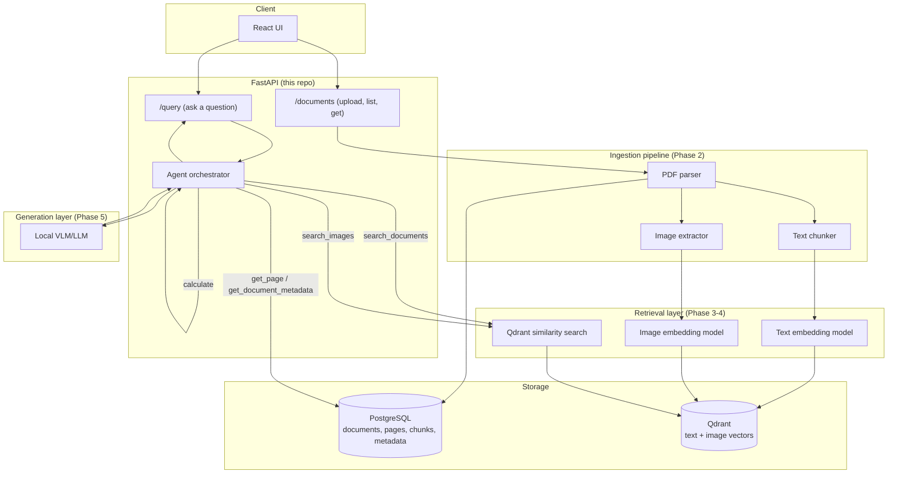

# Architecture & Scope

Current status: **Phase 3 complete** (semantic search). Phase 1 defined the
scope, data model, and interfaces below; Phase 2 implemented the PDF →
structured document pipeline; Phase 3 added embeddings, the Qdrant index, and
a `/search` endpoint.


## Domain

**Industrial equipment technical manuals.** A user uploads a PDF manual (text,
tables, diagrams, photos) and asks natural-language questions about the
equipment it describes. The system answers using evidence retrieved from the
manual and cites the source page(s). When the manual doesn't contain enough
evidence, it says so instead of guessing.

## Supported inputs

- PDF documents containing:
  - body text
  - tables
  - diagrams / schematics / photos (raster images embedded in the PDF)
- One manual at a time is treated as a `Document`; a manual can span many
  `Page`s, and each page can yield multiple text `Chunk`s and zero or more
  extracted `Image`s.

## User flow (target, end of Phase 5)

```
Upload PDF
   │
   ▼
Parse (text + tables + images, per page)
   │
   ▼
Chunk text  ──────────────┐
   │                      │
   ▼                      ▼
Embed text            Extract & embed images
   │                      │
   ▼                      ▼
        Qdrant (vectors) + Postgres (metadata)
                   │
                   ▼
        User asks a question
                   │
                   ▼
        Retrieve top-k text chunks + images
                   │
                   ▼
        Local VLM/LLM answers using ONLY retrieved evidence
                   │
                   ▼
        Answer + page citations, or "I don't know"
```

## System architecture (target, end of Phase 8)



## Data model

Every chunk and image is traceable back to its exact source page:

```
Document
  id, filename, uploaded_at, page_count, status

Page
  id, document_id, page_number

Chunk (text)
  id, document_id, page_number, chunk_index, text, embedding_id

Image
  id, document_id, page_number, image_index, storage_path, caption, embedding_id
```

`document_id` + `page_number` are carried on every retrieved unit, which is
what makes citations possible at answer time.

## Component responsibilities (this repo's package layout)

| Package | Responsibility | Phase implemented |
|---|---|---|
| `copilot.ingestion` | PDF → text/table/image extraction, chunking | 2 |
| `copilot.retrieval` | Embedding + Qdrant search (text & image) | 3-4 |
| `copilot.generation` | Local VLM/LLM grounded answering | 5 |
| `copilot.agent` | Tool-using orchestrator (search, calculate, etc.) | 6 |
| `copilot.db` | SQLAlchemy models + session (Postgres) | 1 (schema), used throughout |
| `copilot.api` | FastAPI routes | 1 (skeleton), fleshed out per phase |
| `copilot.core` | Settings, logging | 1 |

Each of `ingestion`, `retrieval`, `generation`, `agent` declares its contract
as an **abstract interface** in `base.py` — the Phase 1 deliverable — with
concrete implementations landing per phase. `ingestion` is implemented
(Phase 2); `retrieval`, `generation`, and `agent` are still interface-only.

## Ingestion pipeline (Phase 2)

```
PDF upload
    │
    ▼
PdfDocumentParser            (copilot/ingestion/parser.py)
  ├── pdfplumber → per-page text
  ├── pdfplumber → per-page ruled tables → "A | B | C" rows
  └── pypdf      → per-page embedded rasters → PNG on disk
    │
    ▼
ParsedDocument (pages, each with text / tables / images)
    │
    ▼
TextChunker                  (copilot/ingestion/chunker.py)
    │
    ▼
IngestionService             (copilot/ingestion/service.py)
    │
    ▼
Postgres: Document, Page, Chunk, Image rows
```

Decisions worth calling out, since they shape everything downstream:

- **Chunks never span pages.** Page number is carried from extraction through
  to the persisted `Chunk`, so a retrieved chunk always resolves to exactly
  one page — the precondition for the page citations Phase 5 must produce.
- **Structure before length.** Text splits on paragraphs, then sentences, and
  only hard-splits mid-sentence as a last resort, because chunks that begin
  or end mid-thought retrieve poorly.
- **Tables are chunked separately from prose** and prefixed with `[Table]`.
  Technical manuals put specifications and tolerances in tables; merging
  their rows into surrounding paragraphs would destroy row/column adjacency
  and make exactly the questions this system targets unanswerable.
- **Overlapping chunks.** Each chunk repeats the tail of its predecessor, so
  a fact straddling a boundary stays retrievable.
- **Tiny images are filtered out** (default: under 64×64). Manuals repeat
  logos, rules, and spacer graphics on every page; indexing them would bury
  real diagrams in image search results.
- **Detected grids must pass a quality gate to count as tables.** Line-based
  detection fires on any ruled box, and an illustrated manual is full of them:
  diagram frames, figure borders, callout grids, chart axes. A grid is kept
  only if it has ≥2 rows and columns, ≥4 populated cells, ≥30% of its cells
  filled, and either real letters or (for an unlabelled numeric grid) ≥8
  filled cells across ≥3 rows — a plotted axis occupies one or two.
- **Rejecting a grid must not delete its text.** Because kept tables are
  excluded from the page text, only *kept* tables are excluded; a rejected
  frame's words stay in the prose where they belong.
- **Unresolvable glyph ids are stripped.** pdfminer emits `(cid:N)` when a
  font has no ToUnicode map. That text is unrecoverable at this layer and is
  pure noise in a vector index, so it is removed rather than embedded.
- **Failures stay visible.** A PDF that cannot be parsed leaves a `Document`
  row with status `failed` rather than vanishing, and a single unparseable
  table or undecodable image never costs the rest of the page.

### Measured against real manuals

The gate's thresholds were tuned on three real Grundfos pump manuals
(UPS3, 22 pp; CR/CRI/CRN/CRT, 28 pp; CMBE, 12 pp), not chosen a priori.
Before/after, per manual:

| Manual | Junk tables before | after | `(cid:N)` chunks before | after |
|---|---|---|---|---|
| CMBE  | 8 of 8   | 0 | 14% | 0% |
| CR    | 8 of 15  | 0 | 0%  | 0% |
| UPS3  | 12 of 17 | 1 → 0 | 2% | 0% |

Roughly two thirds of everything the table detector reported in these manuals
was not a table. Ingestion runs at 1.4–3.8 s per manual on CPU, and no page
failed to yield text.

### Known limitations

- **Mirrored and doubled text.** Some manuals draw text with a mirrored text
  matrix or draw it twice to fake bold, which pdfminer reproduces literally
  (`)BG( hsilgnE` for "English (GB)"; `sesceocnodnsds` for "seconds").
  Detecting this reliably needs a dictionary check per token, which is
  fragile; the observed instances sat inside grids the table gate rejects.
- **`(cid:N)` text is dropped, not recovered.** Recovering it would require
  rendering the page and running OCR — a reasonable Phase 4 addition for
  scanned or badly-embedded manuals, since the VLM sees page images anyway.
- **A few diagram callout boxes still pass the gate** when they hold enough
  real words. Their content is genuine manual text, so this is mild noise
  rather than garbage.

Two libraries are used deliberately: **pdfplumber** for text and tables (its
line-based table detection is the reason it's here) and **pypdf** for
embedded images. Both are permissively licensed and pure-Python, so ingestion
needs no system packages and behaves identically on a laptop and in the API
container. Neither pulls in torch, which is why the whole pipeline is
testable without any ML dependencies installed.

## Retrieval (Phase 3)

```
Chunk rows (Postgres)                     Question
        │                                     │
        ▼                                     ▼
 embed_documents()                       embed_query()
 (no prefix)                    ("Represent this sentence…" prefix)
        │                                     │
        ▼                                     ▼
   Qdrant upsert  ─────────────────►  cosine top-k + document filter
   id = chunk id                              │
   payload: document_id,                      ▼
   page_number, chunk_index, text     Evidence(page_number, text, score)
```

- **Postgres stays the source of truth.** Qdrant holds vectors plus only the
  payload needed to resolve a hit back to its page, and the point id *is* the
  chunk id, so there is no separate identifier to keep in sync.
- **Queries and passages are embedded differently.** BGE is trained
  asymmetrically: queries carry an instruction prefix, passages do not.
  Omitting it measurably degrades retrieval, so `embed_query` and
  `embed_documents` are separate operations rather than one `embed()`.
- **Vectors are normalized** and the collection uses cosine distance, which
  keeps scores comparable across queries.
- **Re-indexing deletes the document's points first.** Otherwise a manual that
  shrank after a re-parse would keep answering from text it no longer has.
- **`document_id` is a payload index**, since it is the only field ever
  filtered on and an unindexed filter makes Qdrant scan.
- **Indexing on upload is best-effort.** If the model or Qdrant is
  unavailable, the upload still succeeds, the document stays `parsed`, and
  the response reports `indexed_chunks: 0`; `POST /documents/{id}/index`
  retries. Ingestion never depends on torch being installed.

Document status moves `parsing` → `parsed` → `indexed` (or `failed`).

### Measured on real manuals

Against the same three Grundfos manuals, on CPU with `bge-small-en-v1.5`:

| | |
|---|---|
| Model load (cached) | ~2 s |
| Embedding throughput | ~20 chunks/s |
| Query latency | 14–20 ms |
| Index size | 228 chunks across 3 manuals |

Retrieval answers paraphrased questions correctly — "How do I vent or prime
the pump?" returns the CMBE page describing filling through the vent port and
the UPS3 section literally titled "Venting the pump", neither of which shares
the question's wording.

**Scores cluster in a narrow band (≈0.64–0.78).** This is characteristic of
BGE and matters for Phase 5: a fixed score floor is not a usable test for
"is the evidence sufficient?", because a plausible hit and an off-topic one
differ by less than 0.15. The integration tests therefore assert a *relative*
gap between on- and off-topic queries, and Phase 5 will need a better
sufficiency signal than a threshold — likely asking the model itself whether
the retrieved passages actually answer the question.

## Chosen local models (subject to change as phases land)

Everything below is free, open-weight, and runs entirely locally — no paid
APIs, no API keys, no per-token billing anywhere in this stack. The
constraint that matters here isn't cost, it's **compute**: this project is
developed on a machine with only integrated graphics (no dedicated
NVIDIA/AMD GPU), so every model is chosen to run acceptably on CPU rather
than assuming a discrete GPU with real VRAM is available.

- **Text embeddings:** `BAAI/bge-small-en-v1.5` via `sentence-transformers` —
  a ~33M-parameter model, fast enough for CPU-only encoding at ingestion and
  query time, with retrieval quality close to the larger `bge-base` variant.
- **Image embeddings (for image retrieval):** CLIP ViT-B/32
  (`openai/clip-vit-base-patch32`) via `transformers` — the smallest common
  CLIP variant, shared embedding space with text via a separate text tower,
  cheap enough to batch-encode extracted diagrams/photos on CPU.
- **Answer generation (VLM):** `vikhyatk/moondream2` — a ~1.9B-parameter
  vision-language model explicitly built for edge/CPU inference, with strong
  document/diagram/OCR-style understanding for its size. This replaces a
  larger 7B-class VLM (e.g. Qwen2-VL-7B), which is impractical without a
  dedicated GPU. `SmolVLM2-2.2B-Instruct` is a documented fallback if
  `moondream2` doesn't hold up on a given manual. Quantized GGUF builds run
  via `llama.cpp`/`llama-cpp-python` are worth evaluating in Phase 5 if raw
  `transformers` CPU inference is too slow.
- **Vector store:** Qdrant, run locally via Docker.
- **Metadata store:** PostgreSQL, run locally via Docker.

Model choices are read from `copilot.core.config.Settings` (env-driven), not
hardcoded, so they can be swapped without touching pipeline code — e.g. if
this later runs on a machine with a real GPU, swapping back to `bge-base`
and a 7B VLM is a config change, not a rewrite.

## Repository skeleton

```
industrial_ai_copilot/
├── ARCHITECTURE.md
├── README.md
├── pyproject.toml
├── docker-compose.yml
├── docker/
│   └── api.Dockerfile
├── src/copilot/
│   ├── main.py                 # FastAPI app factory
│   ├── core/                   # settings, logging
│   ├── api/routes/             # health, documents, query
│   ├── db/                     # SQLAlchemy models + session
│   ├── schemas/                # Pydantic request/response models
│   ├── ingestion/              # DONE (Phase 2)
│   │   ├── base.py             #   DocumentParser interface
│   │   ├── parser.py           #   pdfplumber + pypdf implementation
│   │   ├── chunker.py          #   page-scoped, structure-aware chunking
│   │   └── service.py          #   parse -> chunk -> persist orchestration
│   ├── retrieval/              # DONE for text (Phase 3)
│   │   ├── base.py             #   Retriever interface, Evidence
│   │   ├── embedder.py         #   sentence-transformers, BGE query prefix
│   │   ├── vector_store.py     #   Qdrant collection, upsert, filtered search
│   │   ├── indexer.py          #   Chunk rows -> vectors
│   │   ├── retriever.py        #   query -> Evidence
│   │   └── deps.py             #   lazy, cached stack assembly
│   ├── generation/base.py      # AnswerGenerator interface       (Phase 5)
│   └── agent/base.py           # Tool / Agent interfaces         (Phase 6)
└── tests/
```

## What isn't built yet

Generation is still interface-only, so `/query` returns `501 Not Implemented`
until Phase 5. Retrieval is text-only: `Image.embedding_id` stays null until
Phase 4 adds image embeddings and merges both kinds of evidence, which is why
`Evidence` already carries a `kind`.

Ingestion currently runs synchronously inside the upload request. FastAPI
executes the sync route in a threadpool so it does not block the event loop,
but a large manual will hold the connection open for the duration; moving it
to a background task is a Phase 8 concern.

Tables are created from the models on app startup. That is deliberate for now
and should become Alembic migrations once the schema needs to change without
dropping data.
